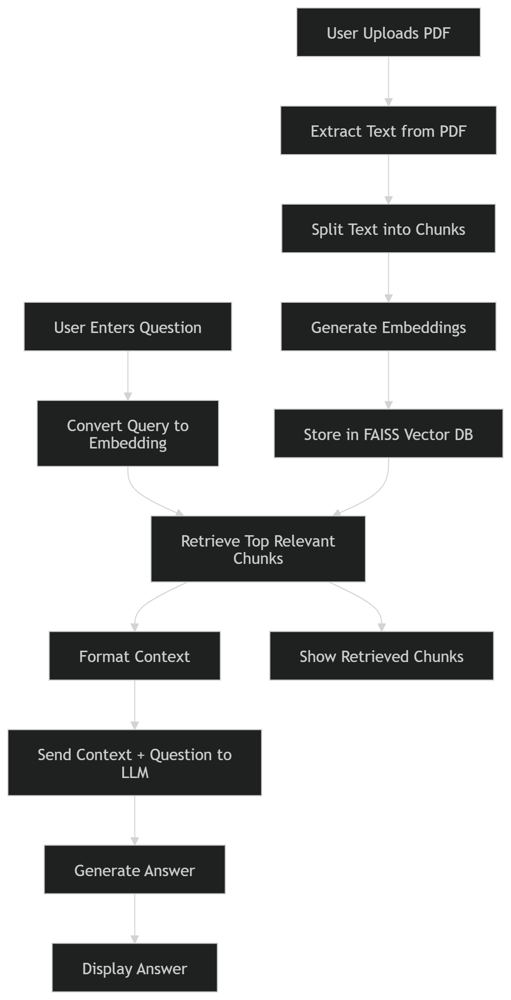

# DocuQuery – PDF Question Answering using RAG

## Overview
DocuQuery is a simple Retrieval-Augmented Generation (RAG) project that allows users to upload a PDF and ask questions based on its content.

Instead of relying only on a language model, the system retrieves relevant parts of the document and uses them as context to generate answers. This helps produce more accurate and grounded responses.

---

## How It Works

1. User uploads a PDF  
2. Text is extracted and split into smaller chunks  
3. Each chunk is converted into embeddings  
4. Embeddings are stored in a FAISS vector database  
5. When a question is asked:  
   - Relevant chunks are retrieved  
   - These chunks are passed to the LLM  
   - The model generates an answer based only on retrieved content  

---

## Architecture



---

## Features

- Upload and process PDF documents  
- Ask questions based on document content  
- Uses vector search for retrieving relevant information  
- Displays retrieved chunks for transparency  
- Simple Streamlit interface  

---

## Tech Stack

- Python  
- LangChain  
- FAISS (Vector Database)  
- Google Generative AI (LLM) & HuggingFace (Embeddings)  
- Streamlit (UI)  

---

## Project Structure

```text
docuquery-rag/
│── ui.py
│── rag_pipeline.py
│── requirements.txt
│── .env.example
│── .gitignore
│── README.md
│── uploads/
│── assets/
│ └── diagram.png
```

---

## Setup Instructions

### 1. Clone the repository

```bash
git clone https://github.com/srujangowda07/Docquery_RAG.git
cd Docquery_RAG
```

---

### 2. Install dependencies

```bash
pip install -r requirements.txt
```

---

### 3. Add API Key

Create a `.env` file and add:

```env
GOOGLE_API_KEY=your_api_key_here
```

---

### 4. Run the application

```bash
streamlit run ui.py
```

---

## Usage

1. Upload a PDF file  
2. Wait for processing  
3. Ask questions in the input box  
4. View:
   - Generated answer  
   - Retrieved document chunks  

---

## Notes

- This is a basic implementation to understand how RAG systems work  
- The model answers only based on retrieved content  
- If information is not found, it avoids generating incorrect answers  
